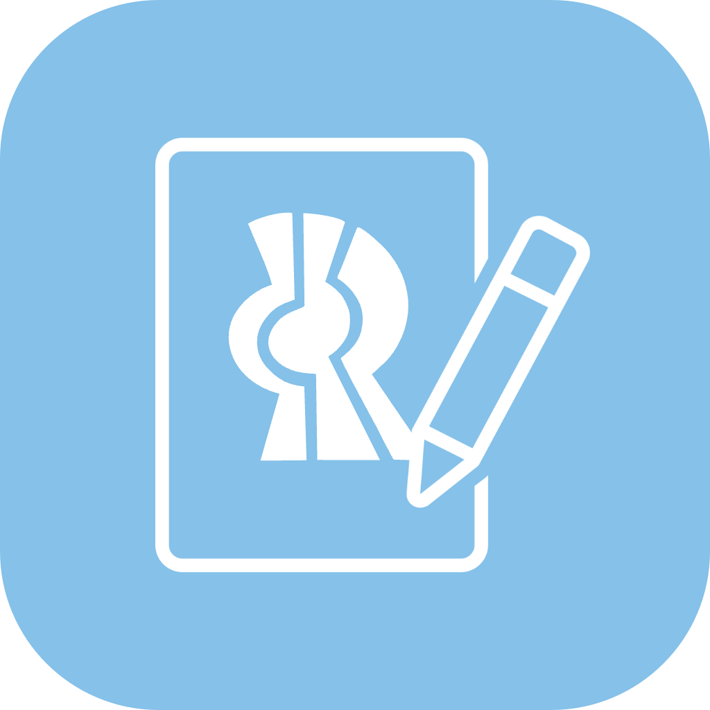

![Lenguaje][language-shield]
![Version][version-shield]
<!-- Estos no funcionarán hasta que el repo sea público -->
[![Issues][issues-shield]][issues-url]
[![Forks][forks-shield]][forks-url]
[![Stargazers][stars-shield]][stars-url]

  

# Formulario Nuevo Ingreso
Sistema automatizado de recopilación de datos de estudiantes de nuevo ingreso del Centro Universitario de Ciencias Exactas e Ingenierías

Este proyecto está publicado bajo la **licencia MIT**. Para obtener una copia de la licencia visita este [enlace][license-url].

> **Warning**
>
> Trabajo en progreso...

## Roadmap

### General
- [ ] Mejorar readme para lanzamiento público
    - [ ] Agregar desarrolladores y colaboradores

### Frontend
- [x] Definir diseño
- [x] Crear campos para todos los datos del formulario
    - [x] Nombre(s)
    - [x] Apellido Paterno
    - [x] Apellido Materno
    - [x] Código de estudiante
    - [x] Dirección
    - [x] Código postal
    - [x] Ciudad de origen
    - [x] Nombre de padre o tutor
    - [x] Teléfono de padre o tutor
    - [x] Correo electrónico
    - [x] WhatsApp
    - [x] Cumpleaños
    - [x] Tipo de sangre
    - [x] Firma
- [ ] Crear icono para la página
- [ ] Crear modal para firma (usando [Signature Pad][signature-pad-url])
    - [x] Centrado
    - [ ] Botones para limpiar y guardar el canvas
    - [ ] Descartar los cambios al cerrar el modal
    - [ ] Definir cómo se enviarán los datos de la firma (png, jpg, svg, etc)
- [ ] Checar que todos los campos estén llenos antes de enviar el formulario, y los que no marcarlos con rojo
- [ ] Crear script de envio y modal de confirmación
    - [ ] Centrado
    - [ ] Enviar formulario mediante XMLHttpRequest o fetch()
    - [ ] Añadir un timeout si el servidor no responde (ya sabemos cómo es el internet de CUCEI)
        - 10 segundos?
    - [ ] Checkmark y cross animados
    - [ ] Limpiar formulario después de un envío exitoso

### Backend
- [ ] Definir diseño
- [ ] Expandir roadmap a objetivos más concisos
- [ ] Desarrollar backend en PHP
    - [ ] Responder al request con 'OK' si la solicitud fue recibida y procesada
- [ ] Crear base de datos de MySQL

 

Este proyecto ha sido </> con <3 por el Club de Programación CUCEI 💻

<!--------------------->
<!--     Enlaces     -->
<!--------------------->

<!-- Badges estáticos -->
[language-shield]: https://img.shields.io/badge/LENGUAJE-HTML%2C%20JS%2C%20PHP-orange?style=for-the-badge
[version-shield]: https://img.shields.io/badge/VERSION-0.1%20pre--alpha-brightgreen?style=for-the-badge

<!-- Badges dinmámicos -->
[issues-shield]: https://img.shields.io/github/issues/Programacion-CUCEI/formulario-ni.svg?style=for-the-badge
[issues-url]: https://github.com/Programacion-CUCEI/formulario-ni/issues
[forks-shield]: https://img.shields.io/github/forks/Programacion-CUCEI/formulario-ni.svg?style=for-the-badge
[forks-url]: https://github.com/Programacion-CUCEI/formulario-ni/network/members
[stars-shield]: https://img.shields.io/github/stars/Programacion-CUCEI/formulario-ni.svg?style=for-the-badge
[stars-url]: https://github.com/Programacion-CUCEI/formulario-ni/stargazers

<!-- Otros enlaces -->
[license-url]: https://github.com/Programacion-CUCEI/formulario-ni/blob/main/LICENSE
[signature-pad-url]: https://github.com/szimek/signature_pad